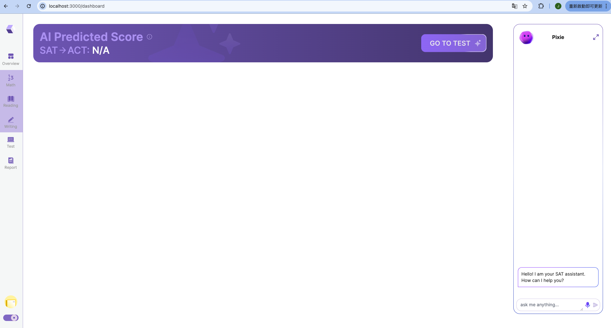

# Frontend Interview Test
This is a [Next.js](https://nextjs.org/) project bootstrapped with [`create-next-app`](https://github.com/vercel/next.js/tree/canary/packages/create-next-app).

## Install Packages
```
npm install --force
```

## Run
```
npm run dev
```
then test it at http://localhost:3000/
the webpage will be like this


## Figma Page is [here](https://www.figma.com/design/jKHFxfaIEhEZWDRcqY7W5s/Frontend-test-UI?node-id=0-1)
